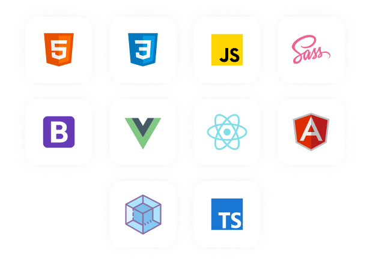
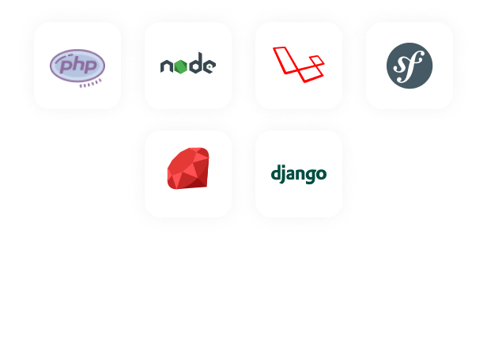

    

<h1 align="center">Hi 👋, I'm Rapha</h1>
<h2 align="center">My name is Rapha, 24 year old, I love programming 💖.</h2>

 
 

<h2 align="center">🏆 GitHub Trophies</h2>

    

 
 

<h2 align="center">Skills 🔥</h2>
<table>
    <tr>
        <td>
            <h2 align="center">Frontend Skills</h2>
            
        </td>
        <td>
            <h2 align="center">Backend Skills</h2>
            
        </td>
    </tr>
</table>

 
 

<h2 align="center">Github stats 📈</h2>

    
    

 
 

<h2 align="center">💰 You can help me by Donating<h2>
    

    <a href="https://buymeacoffee.com/mgcodeur">
        
    <a>

        
 
 
        
<h2 align="center">profile views counter</h2>

    

