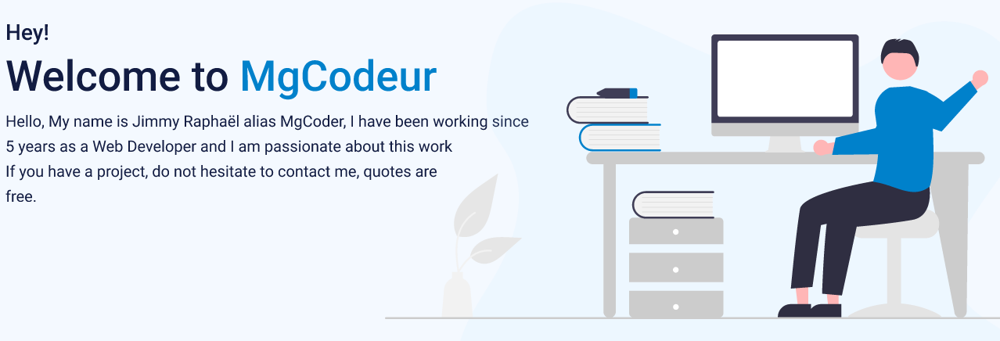

    

# 🔥 Skills:
<table>
    <tr>
        <td>
            <h2 align="center">Frontend Skills</h2>
            
        </td>
        <td>
            <h2 align="center">Backend Skills</h2>
            
        </td>
    </tr>
</table>

# 📊 GitHub Stats:
 
  

## 🌐 Socials:
     

## 💰 You can help me by Donating
<a href="https://buymeacoffee.com/mgcodeur">
    
<a>
